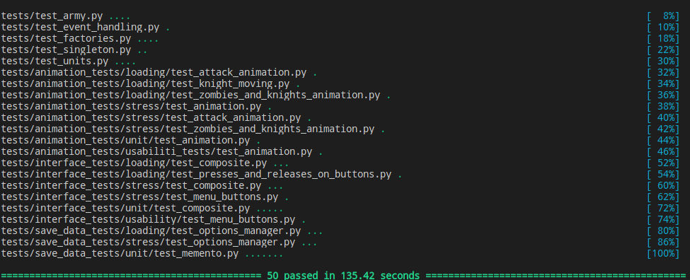

# Battle for Indent [](https://travis-ci.com/ficrus/battle-for-indent)

## Об игре

**Battle for Indent** - это небольшая стратегия, в которой Вам предстоит защитить свой замок от нападения заклятого врага.
В Вашем распоряжении находятся лучшие войны Отступляндии, которые ценой своей жизни готовы отстаивать идеалы своего военачальника.


## Завязка

Война... война не меняется. Люди всегда находят повод поднять друг против друга мечи.
Так произошло и в этой истории. Некогда неразлучимые правители в один день узнали друг о друге страшную тайну.
Как оказалось, один из них в своих письмах делает отступы с помощью табуляции, а второй - с помощью пробелов.
Никакое чудо не смогло бы сохранить их дружеские узы после такого предательства.
Отныне они самые настоящие враги, которые не успокоятся, пока их принципы не скажут последнее слово.


## Описание игрового процесса

Игровая карта представляет из себя два замка, стоящих слева и справа, а также 3 тропы, соединяющих их. От того, на какую тропу поставлен юнит, зависит его скорость (чем выше юнит, тем он быстрее).

У каждого игрока в распоряжении имеется 4 юнита, доступных для отправки на поле боя. Данные юниты имеют свои характеристики и отличительные особенности, что делает важным выбор своего войска. Конечно, самые сильные войны не будут сражаться за Вас просто так. Одерживайте победы и заслужите их доверие. 

Помимо выбора войска, важную особенность будет играть путь, по которому будет отправлен этот юнит. Тропы могут замедлить Ваших юнитов, поэтому в разных ситуациях эти особенности могут стать как и тузом в рукаве, так и медвежьей услугой.

Как только юнит доберется до вражеского замка, начнётся его осада. По завершении осады победа присуждается осаждавшему игроку.

## Юниты

Общее определение того, что из себя представляют юниты, излишне.
Рассмотрим техническую сторону реализации юнитов в данной игре.
Каждый класс юнита наследуется от абстрактного класса `BaseUnit`, имеющего следующие поля:

1. `fraction`
2. `job`
3. `hp`
4. `physical_damage`
5. `magical_damage`
6. `physical_resist`
7. `magcal_resist`
8. `move_speed`

Первое из них определяет сторону, за которую воюет данный юнит. Второе - его класс. Название остальных полей говорит само за себя.
Расширение списка юнитов не составляет никакого труда, поскольку все функции и методы, отвечающие за работу с юнитами, принимают в качестве аргумента `BaseUnit`. То есть `Bandit`, `Knight`, `Mage`, `Developer` и тому подобные юниты будут иметь общий интерфейс.

Для создания юнитов используются фабрики (паттерн `Factory Method`). Каждая из фабрик наследуется от абстрактного класса `UnitFactory`, имеющего абстрактный метод `create`.
Как и в случае с юнитами, работа с фабриками происходит через один интерфейс.
Достоинством данного паттерна в данной ситуации является то, что мы не работаем с каждым классом юнита напрямую, мы используем при создании общий для них всех интерфейс. 

Также в работу фабрик был внедрён паттерн `Singleton`. В нашей ситуации паттерн гарантирует, что во время работы программы будет создано не более одной фабрики для каждого класса юнитов.
Это гарантирует, что все юниты, имеющие одинаковое значение поля `job` будут созданы одинаково.

## Сложные структуры

При создании игры возникает потребность в создании структур, к каждому элементу которых нужно применить некоторое действие (например, отрисовать каждый элемент интерфейса). Для этих целей нам прекрасно подходит паттерн `Composite`. Реализован он следующим образом: существует абстрактный класс `Component`, наследниками которого являются `Composite` и `Leaf`. Наследники `Composite` являются составными структурами, то есть могут иметь компоненты, входящие в них (методы `add` и `remove` для добавления и удаления соответственно). В то же время, наследники `Leaf` являются простыми структурами, поэтому только что упомянутые методы у них отсутствуют.

В нашей реализации каждый компонент имеет методы `draw` и `update` для отрисовки и обновления в процессе выполнения игры. Сила паттерна заключается в том, что нам нужно вызывать эти методы только один раз - для самого высокого по иерархии члена структур. Далее будут происходить рекурсивные вызовы, в результате которых все объекты будут отрисованы/удалены.

Также `Component` имеет методы, позволяющие получить все элементы (`get_all_elements`) или все листья (`get_leaves`) для структуры, в которой этот `Component` является корнем.

## Описание анимации игровых персонажей

Как и любые объекты, которые нужно отрисовывать, `BaseUnit` - наследник класса `Leaf`, который является наследником `Component`. 

Конкретный `Unit`, будь то `Knight`, `Zombie`, `Paladin` или `Walker`, соответственно, является наследником `BaseUnit`. У каждого `unit`-а есть поле `sprite`, которое отвечает за визуальную составляющую персонажа, а также дополнительные поля, такие как `move_speed`, `scale`, влияющие на положение конкретных частей персонажа. 

Поле `sprite` имеет тип `UnitSprite`, или одного из его наследников: `KnightSprite`, `PaladinSprite`, `ZombieSprite`, `WalkerSprite`. Анимирование персонажей происходит в методе `update(delta_time)`, который вызывается автоматически через определенные интервалы времени у всех наследников `Leaf`. Каждый `UnitSprite` имеет набор частей, из которых состоит персонаж(`object_parts`): руки, ноги, голова, туловище, оружие. 

В методе `update` у этих частей задаются их новые координаты и угол поворота.
У `UnitSprite` есть поля, за определённые движения `unit`-a - ходьбу и атаку. 
Эти поля - классы-наследники класса `AbstractSpriteBehaviour`. Так же у `AbstractSpriteBehaviour` есть наследник `AbstractBehaviourDecorator`, у которого есть наследник `SpeedDecorator`. Соответственно, применяя этот декоратор к любым движениям, можно ускорить или замедлить их. В итоге мы получаем реализацию паттерна Декоратор.

Но важно не только уметь отрисовывать персонажей, но и обрабатывать их взаимодействие между собой. С этим нам поможет паттерн Visitor.

Каждый `unit` из одной армии, по идее, может по-разному взаимодействовать с `unit`-ами разных типов из другой армии. При этом могут отличаться подходы к ведению боевых действий, то есть в разных случаях `unit` может взаимодействовать с одним и тем же `unit`-ом по-разному. Самая простая иллюстрация этого - если армия врага находится справа, то все `unit`-ы, по идее, должны двигаться направо, и наоборот. 

В итоге получаем, что у нас есть абстрактный класс `Visitor` с методами `visit_knight`, `visit_paladin`, `visit_zombie`, `visit_walker`, и конкретные `Visitor`-ы: `LeftArmyVisitor` и `RightArmyVisitor` с конкретными реализациями этих методов. И соответственно, у `BaseUnit` и у его наследников есть метод `accept(visitor)`. Каждую итерацию конкретный `visitor` приходит к каждому `unit`-у и говорит, что делать в той ситуации, в которой тот сейчас находится.

## Сохранение прогресса

Для того, чтобы сохранять прогресс, используется паттерн `Memento`. В нашей игре их два: снимок, сохраняющий состояние глобальных настроек, и снимок, сохраняюший состояние прогресса игры.

За обработку глобальных настроек отвечает `OptionsManager`, а за прогресс - `ProgressManager`. С помощью `Memento` мы можем сохранять состояния, которые они используют. Для этого используется метод `save`. Для восстановления состояния менеджера предназначен метод `restore` (перед этим нужно получить состояние изнутри снимка с помощью метода `get_state`).

Конечно, было бы бессмысленно хранить состояния в виде объектов в оперативной памяти. Для записи на диск менеджеры предоставляют метод `save_on_disk`, который реализован с помощью модуля `pickle`. Сохранённые данные находятся в папке `save_data`. Если по какой-то причине папка пуста, менеджеры создадут новые файлы с данными по умолчанию.

Также менеджеры выступают в роли посредника (паттерн `Proxy`) между частями игры. Например, `BattleFieldState` не должен сообщать напрямую `UnitSelectState`, что игрок победил и можно открыть новый юнит. Вместо этого, оба этих класса обмениваются данными через `ProgressManager`.

## Отображение игры

За отображение игры отвечает класс `Window` с методами `on_draw`, `update`, `on_mouse_press`, `on_mouse_release`, `on_key_press`, `on_key_release`, унаследованными от класса `arcade.Window`, которые служат для отрисовки и обновления окна, а также для обработки действий пользователя. 

Разным игровым меню нужны разные отрисовка, обновление и обработка действий пользователя, поэтому в проекте реализован поведенческий паттерн Состояние: существует класс `State` и его наследники `MainMenuState`, `OptionsState`, `TutorialState`, `FractionSelectState`, `UnitSelectInfo`, `UnitSelectState`, `BattlefieldState`, которые имеют вышеперечисленные методы и реализуют в них поведение конкретного меню, а экземляр класса `Window` имеет поле `state : State`, и делегирует ему поведение, зависящее от состояния. В свою очередь `State` и наследники имеют поле `window: Window`, и могут у него вызвать метод `change_state(state: State)` для смены состояния. Изначально состояние задаётся методом `set_state(state: State)` класса `Window`.

Действия пользователя меняют состояние игры, и некоторым игровым объектам важно знать, какое действие произошло, поэтому в проекте реализован поведенческий паттерн Наблюдатель: существует класс `Listener` с полем `listening_for` - списком типов событий, которые он слушает, и методами обработки каждого типа события.  У него есть наследники: `ButtonListener`, слушающий типы событий `press` и `release` (нажатие и отпускание ЛКМ), и `KeyEventListener`, слушающий тип событий `key_press` (нажатие клавиши). Объекты, которым нужно следить за данными типами событий, являются полями соответствующего слушателя, и методы слушателей по обработке данных событий с ними взаимодействуют. 
Для того, чтобы каждое действие пользователя не проверялось каждым слушателем на наличие в списке типов слушаемых событий, реализован поведенческий паттерн Посредник: существует класс `ListenerSupport` с полем `listeners` - списком слушателей и методами `add_listener(listener: Listener)`, `remove_listener(listener: Listener)`, добавляющими и удаляющими слушателей из списка. При фиксации действия пользователя создается экземляр класса `Event` (его наследников `PressEvent`, `KeyPressEvent`, `ReleaseEvent`), с полем `type` - типом события и полями, содержащими необходимые сведения о действии пользователя (например, координаты нажатия). Этот экземпляр передаётся `ListenersSupport`, который передаёт его дальше слушателям, слушающим данный тип события.

## Использование паттернов Adapter и Command

Мы отказались от использования паттерна `Adapter`, так как реализуем логику различного поведения с помощью паттерна `Decorator`.

Мы отказались от использования паттерна `Command`, потому что для выполнения необходимых операций по расписанию/очереди достаточно обычного игрового цикла,а также потому что все действия так или иначе выполняются с помощью функций, которыми параметризованы кнопки, это можно назвать недо-реализацией `Command,` но само действие не совсем отделено от исполнителя, то есть нет абстрактного класса `Command`.

## Архитектура игры

В папке `github-desciption/scheme` находятся диаграммы, отображающие отношения между классами, используемыми в игре.

## Используемые инструменты

1. `arcade.py` - графический интерфейс
2. `pytest` - тестирование
3. `GitHub` - хостинг с поддержкой система контроля версий `git`
4. `Travis CI` - система `Continious Integration`
5. `PyPI` - каталог для ПО, написанного на `Python`

## Ресурсы игры

1. Все изображения нарисованы членом нашей команды
2. Фоновая музыка: [freesound](https://freesound.org/people/ShadyDave/sounds/273205/)
3. Звук нажатия: [freesound](https://freesound.org/people/Reitanna/sounds/323750/)

## Сетевая игра

Студия `ficrus` имеет колоссальный бюджет, который составляет куча дедлайнов и уд3 по тайм-менеджменту, поэтому сетевая игра на данный момент не реализована.

Так как игровой процесс для обеих сторон симметричен, то сетевая игра возможна, причём для обоих игроков она будет выглядеть одинаково.

## Зависимости

Для корректного запуска программы необходимо иметь установленными все пакеты из файла `requirements.txt`.
Установить пакеты можно с помощью инструмента `pip`:

```
$ pip install -r requirements.txt
```

## Тестирование

Если требуется протестировать работоспособность компонентов игры, можно вопспользоваться инструментом `pytest`.
При запуске она запустит все тесты из папки `tests`.
Успешное прохождение всех тестов будет означать то, что все модули программы функционируют нормально.

К сожалению, `Travis CI` не позволил нам проверить все тесты, поскольку существует некоторая несовместимость при использовании графических библиотек. Однако без проблем удалось выполнить все тесты на обычном компьютере:



## Запуск игры

Для того, чтобы начать игру, нужно сделать всего лишь парочку несложных действий:

1. UNIX-based

```
$ git clone https://github.com/ficrus/battle-for-indent.git
$ cd battle-for-indent
$ git checkout dev
$ cd battle-for-indent
$ pip install --user -r requirements.txt
$ python3 play.py
```

2. Windows

Если Ваша операционная система - Windows, то просто используйте аналогичные команды.